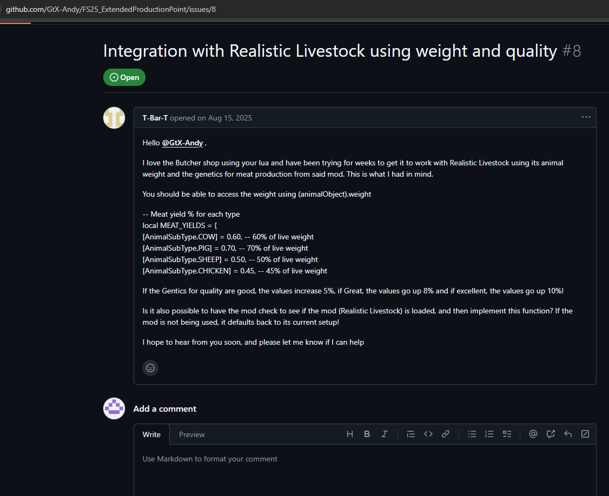
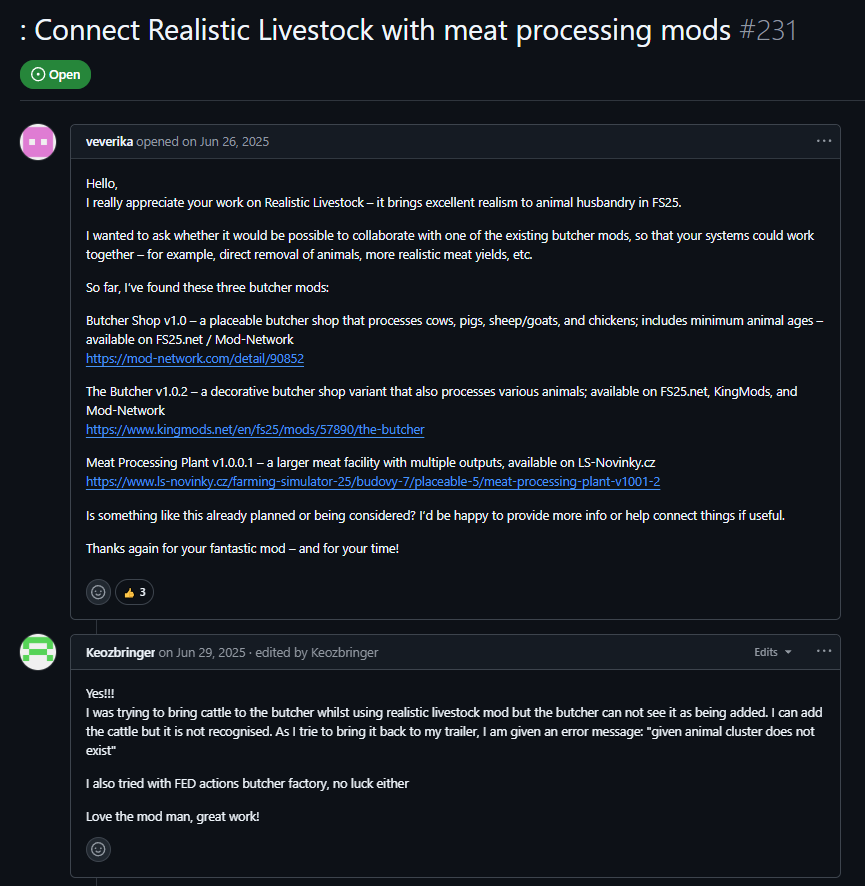
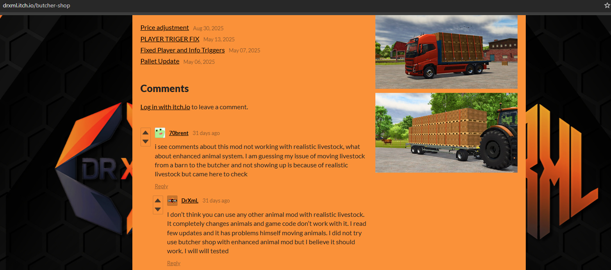
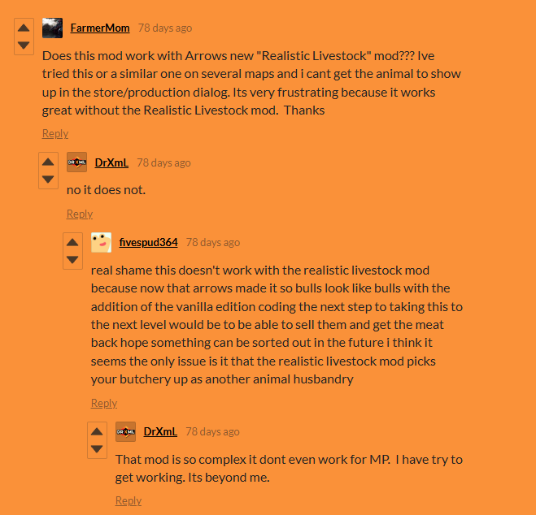

# PlaceableExtendedProductionPoint Override
Free, in all the ways. Do whatever you want IDGAF.


## Overview
This override bolts Realistic Livestock support onto GtX Andy's `PlaceableExtendedProductionPoint`. It installs compatibility helpers on load, attaches to the production point's cluster system, and converts incoming animals into meat outputs based on their genetic values (Simple meat quality check, to be expanded (again))


https://github.com/user-attachments/assets/e1a1b19a-4aeb-4e2e-a60a-e14187ef0b48


## Integration
1. Drop [`PlaceableExtendedProductionPointOverrides.lua`](PlaceableExtendedProductionPointOverrides.lua) into the directory where PlaceableExtendedProductionPoint.lua is located. Add an entry in your modDesc XML to also call this script, like so:
```
	<extraSourceFiles>
		<sourceFile filename="scripts/PlaceableExtendedProductionPoint.lua" />
		<sourceFile filename="scripts/PlaceableExtendedProductionPointOverrides.lua" /> <<<< ADDED LINE
	</extraSourceFiles>
```

For Hof Bergmann, you would drop this lua into /scripts/, and in modDesc.xml, add a new sourceFile line to the first extraSourceFiles block (in the first 100 lines as of this writing)


## Gallery: Why This Script Exists
The images below capture the desire for such support. I've had this game for 8 days, I wanted that support too.
| | |
| --- | --- |
| [](imgs/GitHub_Andy.PNG)<br>*Andy's Github, request for RL support* | [](imgs/Github_RLMod.PNG)<br>*Realistic Livestock Github, support request* |
| [](imgs/DrXml1.PNG)<br>*DrXml RL Support Inquiry* | [](imgs/DrXml2.PNG)<br>*Follow-up DrXML* |


ToDo/Current bugs:

Transfer Menu is weird if your first is trailer->butcher. It's like half of the menu that's there isn't supposed to be (You shouldn't have an RL Messages tab from the trailer, for some reason- that's how RL is coded), to 'fix' the menu I have to open the Animal Dialog menu from a "true" husbandry first, then head over to the butcher. It's just UI consistency. Kind of. 

Kind of? Because when I just modified Andy's script, I had "Move Selected" (an RL feature) that would let me send 5 animals at once, the way the trailer works. With this Override file, it's throwing a "Buy Selected" where that move button should be, and doesn't move the animals when clicked. Only one at a time works right now.

Make modifier values XML attributes, so users may select their buffs/debuffs as they wish.


